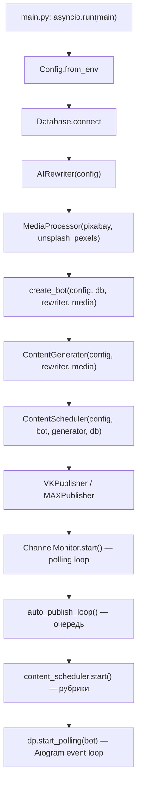
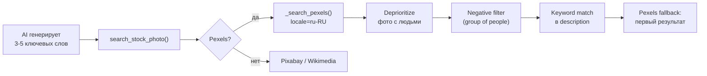

# Izhevsk Today — Architecture & Workflow Reference

> Справочник по архитектуре бота. Открывай этот файл перед любым дебагом, чтобы быстро восстановить контекст.

---

## Файловая структура

```
src/
├── main.py              — Точка входа, инициализация всех компонентов
├── config.py            — Config dataclass, загрузка из .env
├── bot.py               — Aiogram 3 бот: команды, модерация, publishing
├── channel_monitor.py   — Скрапинг каналов через t.me/s/ (без Telethon!)
├── ai_rewriter.py       — AI рерайт: AITUNNEL → Gemini → Groq → YandexGPT → ReText
├── content_generator.py — Генерация рубрик (погода, рецепты, факты и т.д.)
├── content_scheduler.py — Расписание публикации рубрик (9 слотов/день, UTC+4)
├── media_processor.py   — Поиск стоковых фото: Pexels → Pixabay → Wikimedia
├── database.py          — SQLite (aiosqlite): posts, sources, settings, published
├── utils.py             — Хэши, дедупликация, форматирование, определение рубрик
├── vk_publisher.py      — Кросспостинг в VK (стена группы + фото)
├── max_publisher.py     — Кросспостинг в MAX мессенджер
└── init_session.py      — Инициализация Telethon-сессии (legacy, не используется)
```

---

## Запуск бота (`main.py`)



**Три параллельных asyncio-задачи:**
1. **ChannelMonitor** — скрапит `t.me/s/{channel}` каждые `check_interval` секунд
2. **auto_publish_loop** — публикует одобренные посты из очереди каждые `publish_interval` секунд
3. **ContentScheduler** — генерирует и публикует рубрики по расписанию

---

## Pipeline новостей (от источника до канала)

### Шаг 1: Сбор (`channel_monitor.py`)

- Скрапит HTML `https://t.me/s/{channel}` для каждого source_channel
- Парсит `data-post`, `tgme_widget_message_text`, медиа (`background-image`)
- Пропускает forwarded-сообщения, короткие тексты (< `min_text_length`)
- Пропускает погодные посты утром (6-11, свой генератор погоды в 7:00)
- Сохраняет в БД → вызывает `process_new_post(post_id)`

### Шаг 2: Фильтрация (`bot.py: process_new_post`)

7-ступенчатый фильтр **до** рерайта:

| # | Фильтр | Логика |
|---|--------|--------|
| 0a | **Ad filter** | Tier 1: hard ad words (erid, спонсор) → instant reject. Tier 2: 2+ soft ad words |
| 0b | **Topic cooldown** | Погода: max 1 пост/4ч (проверяет `has_recent_topic_post`) |
| 0c | **Geo filter** | Local source: reject если текст про другой регион. Federal source: AI `check_relevance` |
| 0c | **Deduplication** | Tier 1: vs published (12ч). Tier 2: vs queued (12ч). Использует `word_overlap` + `is_similar_to_any` |
| 0d | **Breaking news** | Radar source + local geo keywords → auto-publish без модерации |
| 1 | **AI Rewrite** | `rewrite_full()` — единый вызов: рерайт + хэштеги + фото-ключевые (экономия квоты) |
| 2 | **Post-rewrite dedup** | Дедупликация по переписанному тексту (ловит одну новость из разных источников) |

### Шаг 3: Рерайт (`ai_rewriter.py`)

**Fallback chain:** AITUNNEL → Gemini → Groq → YandexGPT → ReText

- `rewrite_full()` — **один вызов AI** возвращает (текст, хэштеги, фото-ключевые)
- Gemini: **Circuit Breaker** — после 3 ошибок за 1ч отключает Gemini на 60мин
- Gemini: **Multi-key** — `GEMINI_API_KEYS=key1,key2` с автосвитчем
- Gemini: **Multi-model** — пробует `gemini-2.5-flash` → `gemini-2.5-flash-lite` → `gemini-2.5-pro` → ...
- Gemini: **Geo-block protection** — если 400+location, CB на 2ч
- AI refusal detection — 40+ фраз-маркеров отказа (ru/en)

### Шаг 4: Модерация (`bot.py`)

- Пост отправляется админам с **inline-клавиатурой**:
  - ✅ Опубликовать | ❌ Отклонить
  - ✏️ Редактировать | 🔄 Перерайт
  - 🖼 Искать фото
- `auto_publish` режим (env) — пропускает модерацию

### Шаг 5: Публикация (`bot.py: _publish_post`)

1. Отправка в **Telegram** канал (`target_channel`) — фото + текст или текст
2. **VK crosspost** — стена группы (загрузка фото через VK Photos API)
3. **MAX crosspost** — MAX мессенджер (отдельный бот-токен)
4. Запись в `published` таблицу

---

## Расписание рубрик (`content_scheduler.py`)

| Время (UTC+4) | Рубрика | Метод |
|:---:|---|---|
| 07:00 | 🌤 Погода | `generate_weather()` |
| 08:00 | 🎉 Праздник | `generate_holiday()` (только если есть) |
| 09:00 | 📅 История | `generate_history_fact()` |
| 11:00 | 📌 5 фактов | `generate_five_facts()` |
| 13:00 | 🍽 Рецепт | `generate_recipe()` |
| 15:00 | 💡 Лайфхак | `generate_lifehack()` |
| 17:00 | 📍 Место | `generate_place()` |
| 19:00 | 😄 Вечерний | `generate_evening_fun()` |
| 21:00 | 📊 Дайджест | `generate_daily_digest()` |

Каждая рубрика:
1. Генерирует текст через AI (`ask_ai`)
2. Ищет фото через `_find_photo(text, hint_keywords=...)` → `search_stock_photo` → Pexels API
3. Публикует напрямую в канал (минуя модерацию)

---

## Поиск фото (`media_processor.py` + `content_generator.py`)

### Pipeline подбора фото



### Pexels интеграция (текущая)

**Файл:** `src/media_processor.py` → `_search_pexels()`

- **API:** `https://api.pexels.com/v1/search`
- **Авторизация:** `Authorization: {PEXELS_API_KEY}` header
- **Прокси:** `PEXELS_PROXY` — SOCKS5 прокси через NL VPS (Cloudflare блокирует RU IP)
- **Параметры:** `query`, `per_page`, `orientation=landscape`, `locale=ru-RU`
- **Deprioritization:** Если запрос не содержит people-слов → фото без людей в alt-тексте сортируются первыми
- **Размер:** Использует `src.large` (хорошее качество, разумный размер)

### PHOTO_KEYWORDS_PROMPT (content_generator.py)

**Что делает:** AI генерирует 3-5 ключевых слов на английском для поиска.

**Ключевые правила:**
- Избегает людей для инфраструктурных тем → использует architecture, cityscape, infrastructure
- Для тем с людьми (праздник, спорт, семья) → добавляет "russian"
- Только конкретные объекты, не абстракции

### hint_keywords по рубрикам

| Рубрика | hint_keywords |
|---|---|
| history_fact | `["old photograph sepia", "historical archive document"]` |
| daily_digest | `["evening cityscape", "city lights skyline"]` |
| recipe | Маппинг `recipe_photo_map` по типу блюда |
| place | Маппинг `place_photo_map` по названию места |
| holiday | Маппинг `holiday_photo_map` по празднику |

### Negative filter в `_find_photo()`

Если ключевые слова НЕ содержат people/family/crowd/friends:
- Удаляет фото с description содержащим "group of people", "meeting", "team", "coworkers", "colleagues"

### Fallback keywords

Если AI не вернул ключевые слова:
- `["russian city", "winter cityscape"]` (вместо старого `"udmurtia", "russia", "city"`)
- При ошибке: `["cityscape architecture", "urban landscape"]`

---

## Env-переменные

| Переменная | Обязательная | Описание |
|---|:---:|---|
| `BOT_TOKEN` | ✅ | Telegram Bot API token |
| `TARGET_CHANNEL` | ✅ | `@IzhevskTodayNews` |
| `ADMIN_IDS` | ✅ | Comma-separated Telegram user IDs |
| `GEMINI_API_KEYS` | ✅ | Comma-separated (fallback через ключи) |
| `SOURCE_CHANNELS` | ✅ | Comma-separated channel usernames |
| `TELEGRAM_API_ID` | | Telethon API ID (legacy) |
| `TELEGRAM_API_HASH` | | Telethon API hash (legacy) |
| `PEXELS_API_KEY` | | Pexels stock photo API |
| `PEXELS_PROXY` | | SOCKS5 proxy for Pexels (Cloudflare geo-block) |
| `PIXABAY_API_KEY` | | Pixabay fallback |
| `UNSPLASH_ACCESS_KEY` | | Unsplash fallback |
| `AITUNNEL_API_KEY` | | OpenAI-compatible proxy (primary AI) |
| `AITUNNEL_MODEL` | | Default: `gpt-4o-mini` |
| `GROQ_API_KEY` | | Groq LLM API |
| `YANDEX_API_KEY` | | YandexGPT API key |
| `YANDEX_FOLDER_ID` | | YandexGPT folder |
| `OPENWEATHER_API_KEY` | | OpenWeatherMap |
| `YANDEX_WEATHER_API_KEY` | | Yandex Weather (50 req/day) |
| `VK_ACCESS_TOKEN` | | VK group token |
| `VK_USER_TOKEN` | | VK user token (photo uploads) |
| `VK_GROUP_ID` | | VK community ID |
| `MAX_BOT_TOKEN` | | MAX messenger bot |
| `MAX_CHAT_ID` | | MAX chat ID |
| `PUBLISH_INTERVAL` | | Seconds between auto-publish (default 900) |
| `AUTO_PUBLISH` | | `true` = skip moderation |

---

## Админ-команды бота

| Команда | Описание |
|---|---|
| `/start` | Главное меню |
| `/queue` | Посты на модерации |
| `/stats` | Статистика |
| `/sources` | Управление источниками |
| `/publish` | Опубликовать одобренные |
| `/report` | Недельный отчёт |
| `/testcontent {rubric}` | Ручной запуск рубрики |
| `/test_ai` | Тест всех AI движков |
| `/aistats` | Circuit Breaker статус |
| `/testgemini` | Тест Gemini API |
| `/testai` | Тест всех AI с диагностикой |
| `/testvk` | Тест VK API |

---

## БД (SQLite)

**Таблицы:** `sources`, `posts`, `published`, `settings`

**Статусы поста:** `pending` → `rewriting` → `review` → `approved` → `published` (или `rejected`)

**Дедупликация:** `UNIQUE(source_channel, source_message_id)` + smart word_overlap в Python

---

## Типичные баги и как дебажить

| Проблема | Где смотреть | Команда диагностики |
|---|---|---|
| AI не отвечает | `ai_rewriter.py`, circuit breaker | `/test_ai`, `/aistats` |
| Фото с нерусскими | `PHOTO_KEYWORDS_PROMPT`, `_search_pexels` | `/testcontent daily_digest` |
| Pexels 403/429 | `_search_pexels`, прокси | Проверить `PEXELS_PROXY` |
| Посты не публикуются | `auto_publish_loop`, `_publish_post` | `/queue`, `/stats` |
| Рубрика не вышла | `content_scheduler.py` | Логи `data/bot.log` |
| VK crosspost fail | `vk_publisher.py` | `/testvk` |
| Дубликаты проходят | `_find_similar_match` в `bot.py` | Уменьшить threshold |
